# MTG-Color-Classifier
Project to classify the color identify of Magic: The Gathering cards.

Magic: The Gathering (MTG) is a trading card game created by Wizards of the Coast (WotC) where there are 5 principle colors (6 if you include colorless) that make up the color identity of a card. Each color has its own theme that has stayed consistent throughout MTG standard history. This project aims to classify each card to its appropriate color.

## The Data
I got data on all 20,135 cards ever printed in MTG from MTGJSON.com and I webscraped the MTG wiki for a list of sets that were in standard play and a list of everygreen keywords. Keywords are abilities that a card can have and evergreen keywords are keywords that are used in every set. More on why evergreen keywords are important later.

## Features
The features I used to classify the cards were:
- Converted Mana Cost	
- Power
- Toughness
- Power to Toughness Ratio
- Power+Toughness to Converted Mana Cost Ratio
- Keywords
- Card Type
- Number of Reprints

## Data Cleaning
I first dropped all the columns that weren't features or needed to create new features.

My classifiers can only classify each card to a single color, even if the card is a combination of colors, so I filtered the cards such that I only have monocolored cards left. This left me with 18,093 cards.

A lot of the entries were in list form which is not desireable when working in a Pandas DataFrame. These were the card's color, types, and printings. The colors were all single element lists since I was only looking at monocolored cards. I simply converted these into strings. As for `types` and `printings`, I created dummy variables for the types and created a new column called `standard` from `printings` which counted the number of standard sets the card was printed in. To find out which sets were in standard, I scraped the MTG wiki for a list of standard set set-codes.

I only wanted to look at sets that were ever in a standard rotation. Some sets that weren't in standard (like the Un-sets) introduced mechanics that changed how the game is usually played. These sets were very experimental and didn't follow WotC's standard card design. After cutting out cards that were never printed in a standard set, I was left with 16,071 cards.

Only creatures had power and toughness values, while the other card types had NaN values. I filled these NaN values with -1.  Some creatures also have varying power and toughness which I ended up dropping from my data set. Then I created the Power to Toughness Ratio and Power+Toughness to Converted Mana Cost Ratio features. For non-creatures, I defaulted both ratios to be 0.

WotC liked to experiment with new keywords in individual sets, and these keywords would not be reused in other sets. The only exception to this would be the evergreen keywords which are the most basic abilities and are present in all sets. I created a column for each evergreen keyword and set the value to 1 if the card had the keyword in its text and a 0 if it did not.

Finally I dropped all rows that had NaN values to make sure I only had cards with complete data. This left me with 14,737 cards in the end.

## Visualizations
I started by creating a graph to see the distribution of my classes to make sure there isn't a class imbalance.

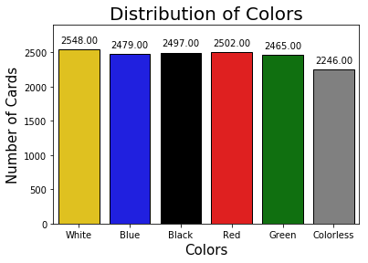

Then I created many graphs to see the class distribution of the features.
### Distribution of Keywords
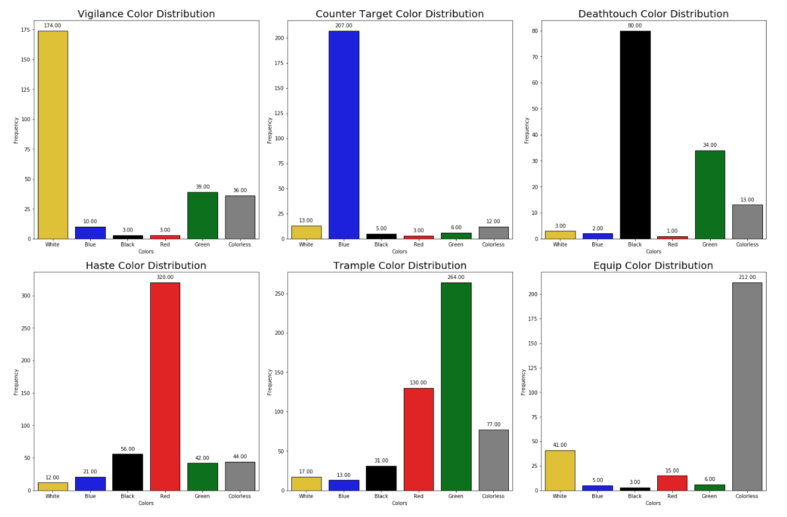
### Distribution of Types
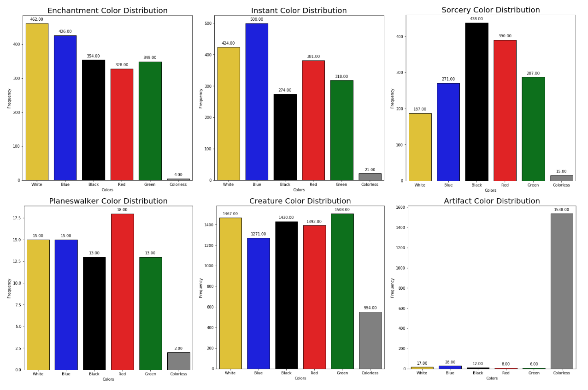

## Models
I split my data into 80% training data and 20% testing data. 
The models that I tried were:
- Dummy Classifier for a baseline
- KNN with tuned k-neighbors
- Decision Trees with tuned max depth and max features
- Bagged Decision Trees and Random Forest
- XGBoost tuned with RandomSearchCV and GridSearchCV

I judged a model's effectiveness on its accuracy score since I currently only care if the model has classified the card correctly or not.

Each model will mention the initial accuracy score and then a final accuracy score if its hyper-parameters were tuned. There will also be a confusion matrix for each model.

### Dummy Classifier
The dummy classifier was a naive classifier that randomly classified the data based on the distribution of classes. It acted as a baseline model with an accuracy of 0.1693 (roughly 1/6 since I had 6 classes).

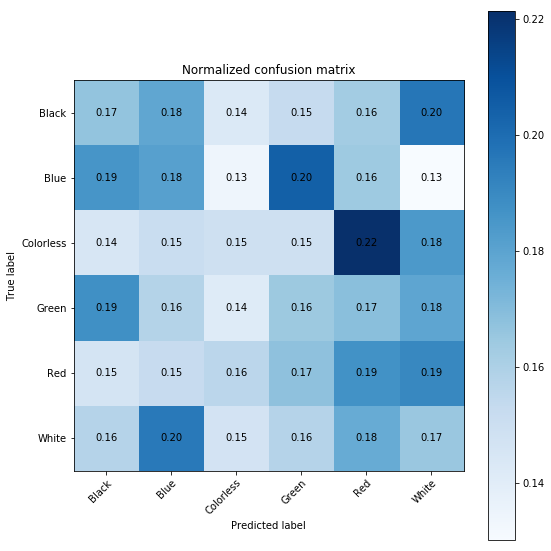
### KNN
An untuned KNN model had an accuracy score of 0.3891 which is already more than twice as accurate as the dummy classifier. However, with some tuning of the `n_neighbors` hyper-parameter, I found the best `n_neighbors` to be 10 with a final accuracy score of 0.4030.

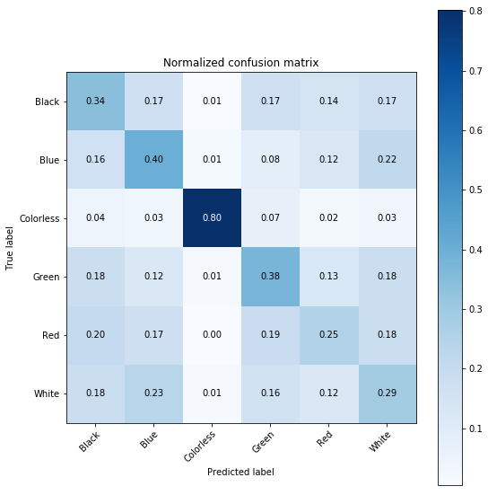
### Decision Trees
An untuned Decision Tree had an accuracy score of 0.4376 which is better than a tuned KNN model. I manually tuned the `max_depth`, `min_samples_split`, and `max_features` hyper-parameters by selecting the values that produced the best accuracy score. I found that tuning `min_samples_split` didn't improve the model so I only changed `max_depth` and `max_features` in the end. After tuning, the accuracy score improved to 0.4552.

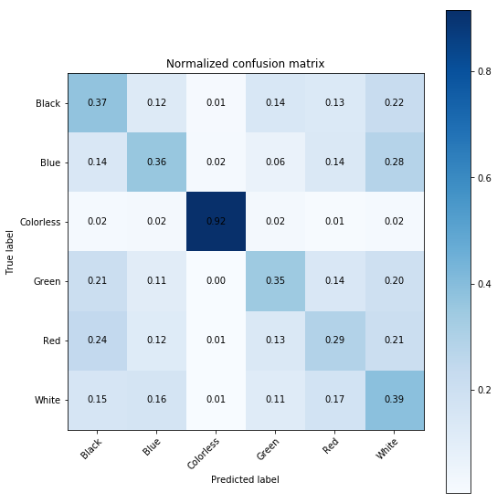
### Bagged Trees
The accuracy score for untuned bagged trees is 0.4192.

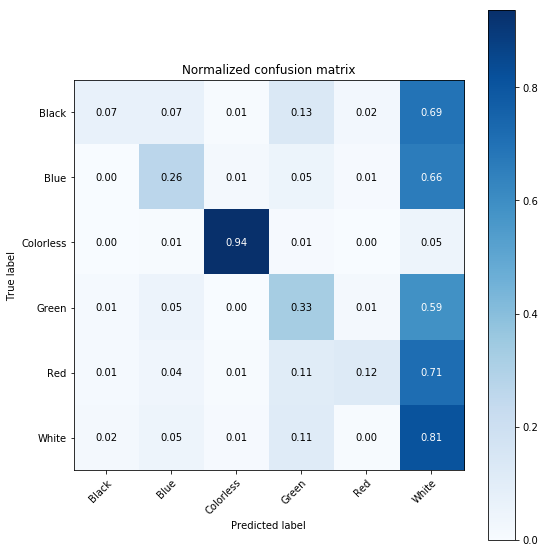
### Random Forest
The accuracy score for untuned random forest is 0.4474.

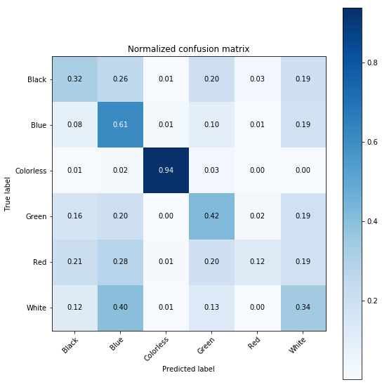
### XGBoost
An untuned XGBoost model had an accuracy score of 0.4701, the highest so far. After an exhaustive tuning with GridSearcdhCV, the accuracy score improved to 0.4763.

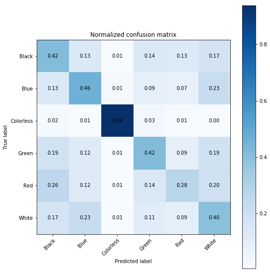
## XGBoost Predictions
Some examples of predictions made by my final XGBoost model. Each prediction was given as an array of percentages corresponding to each class giving how likely the card is to be a certain class.

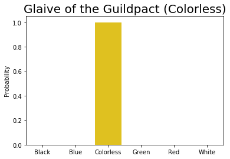

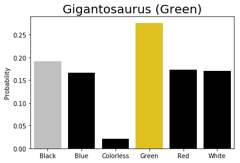
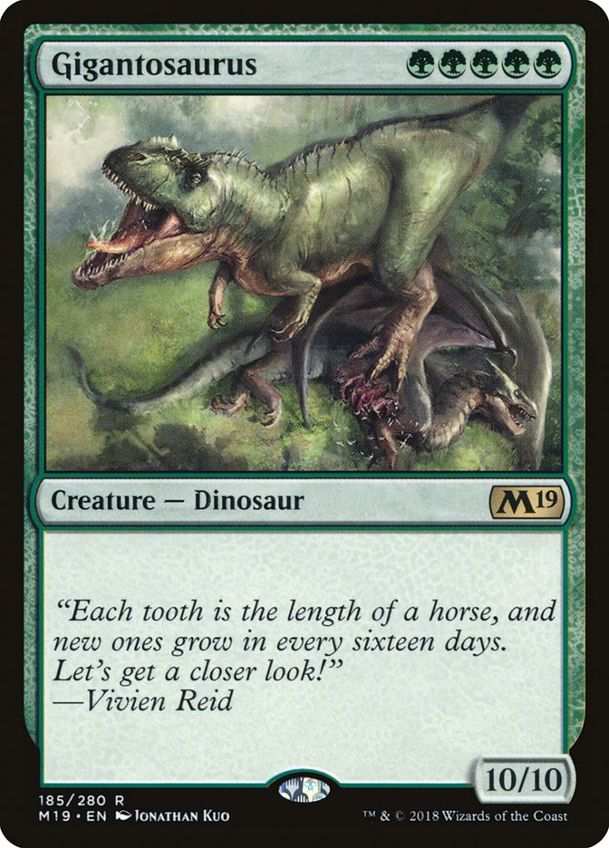

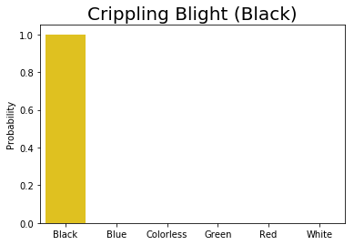
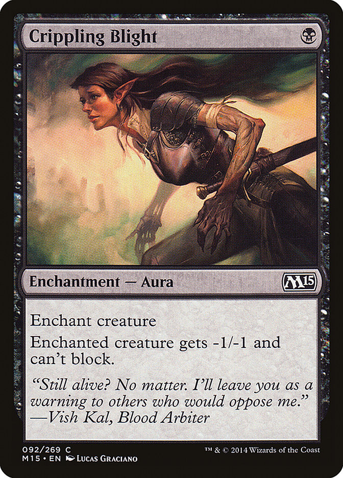

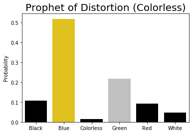
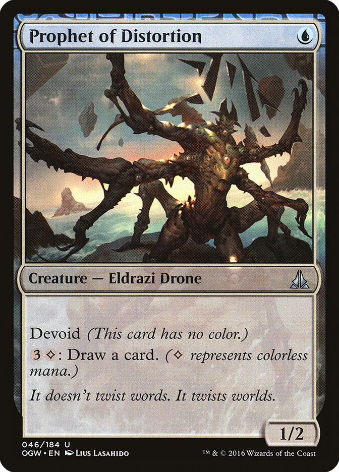

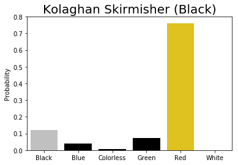
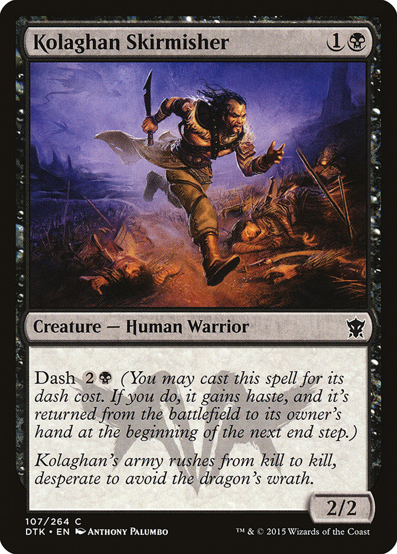

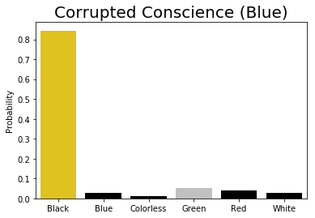
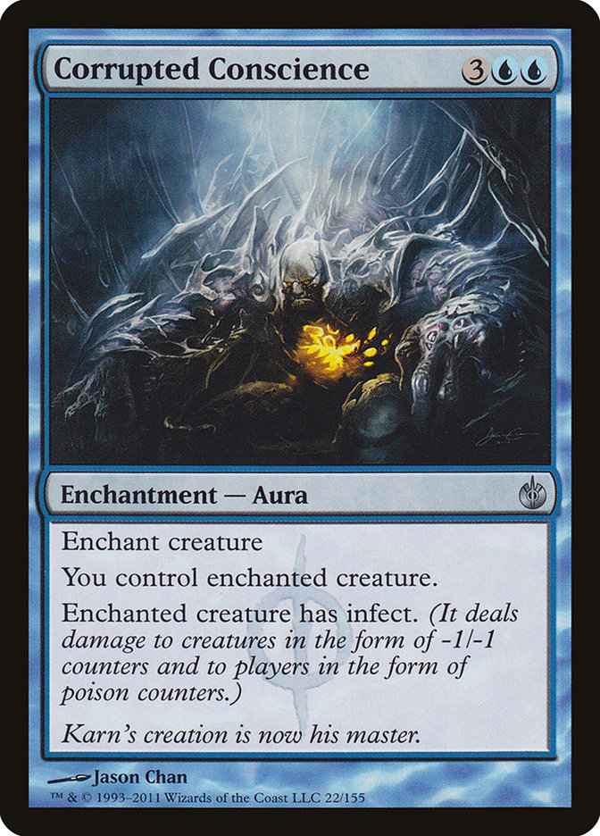

## Possible Improvements
- Include a way to classify multi-colored cards.
- Implement NLP to be able to better use the card text.
- Implement NLP to be able to use the card name as a feature.
- Gather artist information for each card to use as a feature.
- Do more tuning for models.
